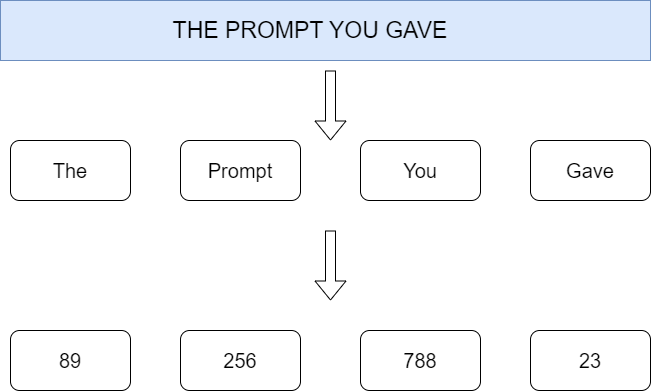
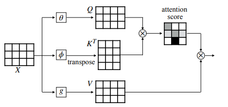
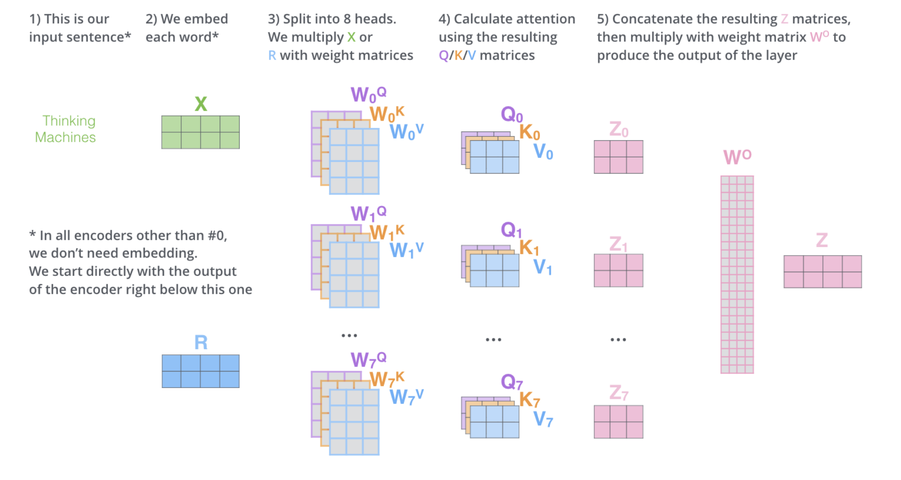
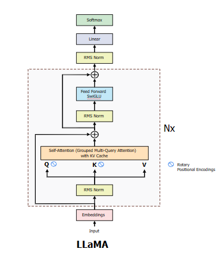

# Llama 3 Implementation from Scratch

## Overview

This repository contains an implementation of the Llama 3 language model from scratch. 

This repository was inspired by the works of AAAAAAAAAA.org and Andreij Karpathy, I am just a passionate learner and Learning from all these open access resources have been really fun to me and i really appreciate the contributions these people are making in the community. My goal with this repo was to implement the llama3_from_scratch repo in a clearer format(karpathy-esque fashion) and (with time) get rid of dependencies.

Firstly you'd need to download the weights of the model from https://llama.meta.com/llama-downloads/

You'll be directeed to the Llama repo after verification and from there you can download the download.sh file and then run it on your system(using git bash)

I am using the same prompt example as the A10 lab did, because The Hitchhiker's Guide to the Galaxy is goated.

Firstly, we will cover the Theory required(u can skip and jump to the code explanation part) then we will see how the code is working.

## Theory

Llama 3 is a large-scale transformer-based language model designed to generate human-like text. The key components of the model include:

1. **Tokenization**: 

Converting text into a sequence of tokens that the model can process.



What is Tokenization?

Tokenization converts raw text into tokens, which are the basic units of meaning in the text. These tokens can be words, subwords, or even individual characters, depending on the tokenization method used. In LLMs, tokenization is essential because it transforms text into a format that can be understood and processed by the model.

Byte Pair Encoding (BPE)

Many modern LLMs, including Llama 3, use Byte Pair Encoding (BPE) for tokenization. BPE is a type of subword tokenization that iteratively merges the most frequent pairs of characters or subwords in the text until a predefined vocabulary size is reached. This method allows the model to handle rare words and new words efficiently.

Steps in BPE Tokenization

Initialize the Vocabulary: Start with a vocabulary of individual characters.

Count Frequencies: Count the frequency of each pair of tokens in the training data.

Merge Frequent Pairs: Merge the most frequent pair of tokens to form a new token. Add this new token to the vocabulary.

Repeat: Repeat the counting and merging steps until the desired vocabulary size is reached.

Example
Consider the word "low" and "lower". Initially, the vocabulary consists of individual characters: {"l", "o", "w", "e", "r"}.

Count the frequency of pairs:

("l", "o"): 1
("o", "w"): 1
("l", "o"): 1
("o", "w"): 1
("w", "e"): 1
("e", "r"): 1
Merge the most frequent pair ("l", "o") to form "lo":

New tokens: {"lo", "w", "e", "r"}
Repeat the process until the desired vocabulary size is reached.

2. **Embedding**: Transforming tokens into dense vector representations.

Embedding is a fundamental concept in Large Language Models (LLMs) like Llama 3. It involves transforming discrete tokens (words, subwords, or characters) into continuous vector representations that capture their meanings and relationships in a high-dimensional space. 


What is an Embedding?

An embedding is a dense vector representation of a token. Unlike one-hot encoding, where each token is represented by a binary vector with a single high value, embeddings are continuous vectors of fixed dimensions. These vectors capture semantic information about the tokens, allowing the model to understand and process language more effectively.

Why are Embeddings Important?

Embeddings serve several crucial purposes in LLMs:

Dimensionality Reduction: Embeddings reduce the high-dimensional space of one-hot encodings into a lower-dimensional space, making computations more efficient.

Semantic Meaning: Embeddings capture the semantic meanings and relationships between tokens. Tokens with similar meanings are represented by vectors that are close to each other in the embedding space.

Handling Sparsity: Embeddings provide dense representations, overcoming the sparsity problem of one-hot encodings.

How are Embeddings Learned?

Embeddings are typically learned during the training of the language model. The training process adjusts the embeddings so that they capture the relationships and meanings of tokens in the context of the tasks the model is trained on.

3. **Attention Mechanism**: Allowing the model to focus on different parts of the input sequence.

# Self-Attention and Multi-Head Self-Attention in Detail

Self-attention and multi-head self-attention are key mechanisms in transformer models, including large language models (LLMs) like Llama 3. These mechanisms allow the model to weigh the importance of different words in a sequence, enabling it to understand context and relationships effectively.

## Self-Attention

Self-attention, also known as scaled dot-product attention, is a mechanism that allows each word in a sequence to focus on other words in the sequence. This helps the model capture dependencies between words, regardless of their distance from each other.



### Key Components: Q, K, and V

- **Query (Q)**: A vector that represents the current word we are focusing on.
- **Key (K)**: A vector that represents each word in the sequence.
- **Value (V)**: A vector that also represents each word in the sequence, used to construct the final output.

### Steps in Self-Attention

1. **Linear Transformations**:
   - For each word in the input sequence, we create Query, Key, and Value vectors by multiplying the word embedding by three learned matrices \( W_Q \), \( W_K \), and \( W_V \).

2. **Calculate Scores**:
   - We calculate a score for each pair of words by taking the dot product of the Query vector of the current word with the Key vectors of all words.
   - This gives us a measure of similarity or relevance between the current word and all other words.

3. **Scale Scores**:
   - The scores are scaled by dividing by the square root of the dimension of the Key vectors (\( \sqrt{d_k} \)). This step stabilizes the gradients during training.

4. **Softmax**:
   - We apply the softmax function to the scaled scores to obtain attention weights. The weights represent the importance of each word in the sequence relative to the current word.

5. **Weighted Sum**:
   - We multiply the Value vectors by the attention weights and sum them up. This gives us a new representation for the current word that incorporates information from all other words.

### Mathematical Formulation

Given:
- Input sequence: \( X \in \mathbb{R}^{n 	imes d} \) (where \( n \) is the sequence length and \( d \) is the embedding dimension)
- Learned weight matrices: \( W_Q, W_K, W_V \in \mathbb{R}^{d 	imes d_k} \)

The steps are:
1. \( Q = XW_Q \)
2. \( K = XW_K \)
3. \( V = XW_V \)
4. \( 	ext{Scores} = rac{QK^T}{\sqrt{d_k}} \)
5. \( 	ext{Attention Weights} = 	ext{softmax}(	ext{Scores}) \)
6. \( 	ext{Output} = 	ext{Attention Weights} \cdot V \)

### Code Example (Simplified)

```python
import torch
import torch.nn.functional as F

def self_attention(query, key, value):
    d_k = query.size(-1)
    scores = torch.matmul(query, key.transpose(-2, -1)) / torch.sqrt(torch.tensor(d_k, dtype=torch.float32))
    attention_weights = F.softmax(scores, dim=-1)
    output = torch.matmul(attention_weights, value)
    return output, attention_weights

# Example usage
query = torch.randn(10, 5, 64)  # (batch_size, sequence_length, embedding_dim)
key = torch.randn(10, 5, 64)
value = torch.randn(10, 5, 64)

output, attention_weights = self_attention(query, key, value)
```
## Multi-Head Self-Attention



Multi-head self-attention is an extension of self-attention that allows the model to focus on different parts of the sequence simultaneously. It achieves this by using multiple sets of Query, Key, and Value weight matrices, known as heads.

### Benefits of Multi-Head Self-Attention

1. **Captures Different Relationships**: Each head can focus on different aspects of the relationships between words.
2. **Improves Expressiveness**: By combining the outputs from multiple heads, the model can represent more complex patterns and dependencies.

### Steps in Multi-Head Self-Attention

1. **Linear Transformations**:
   - For each head, we create separate Query, Key, and Value vectors by multiplying the word embedding by different learned matrices.
   
2. **Self-Attention Calculation**:
   - We apply the self-attention mechanism independently for each head.
   
3. **Concatenation**:
   - We concatenate the outputs from all heads.
   
4. **Final Linear Transformation**:
   - We apply a final linear transformation to the concatenated outputs to produce the final result.

### Code Example (Simplified)

```python
import torch
import torch.nn.functional as F

class MultiHeadSelfAttention(torch.nn.Module):
    def __init__(self, d_model, num_heads):
        super(MultiHeadSelfAttention, self).__init__()
        assert d_model % num_heads == 0
        
        self.d_k = d_model // num_heads
        self.num_heads = num_heads
        
        self.linear_q = torch.nn.Linear(d_model, d_model)
        self.linear_k = torch.nn.Linear(d_model, d_model)
        self.linear_v = torch.nn.Linear(d_model, d_model)
        self.linear_out = torch.nn.Linear(d_model, d_model)
    
    def forward(self, x):
        batch_size = x.size(0)
        
        q = self.linear_q(x).view(batch_size, -1, self.num_heads, self.d_k).transpose(1, 2)
        k = self.linear_k(x).view(batch_size, -1, self.num_heads, self.d_k).transpose(1, 2)
        v = self.linear_v(x).view(batch_size, -1, self.num_heads, self.d_k).transpose(1, 2)
        
        scores = torch.matmul(q, k.transpose(-2, -1)) / torch.sqrt(torch.tensor(self.d_k, dtype=torch.float32))
        attention_weights = F.softmax(scores, dim=-1)
        output = torch.matmul(attention_weights, v)
        
        output = output.transpose(1, 2).contiguous().view(batch_size, -1, self.num_heads * self.d_k)
        output = self.linear_out(output)
        
        return output, attention_weights

# Example usage
x = torch.randn(10, 5, 64)  # (batch_size, sequence_length, embedding_dim)
mhsa = MultiHeadSelfAttention(d_model=64, num_heads=8)
output, attention_weights = mhsa(x)
```

### Explanation

- **Initialization**: The `MultiHeadSelfAttention` class is initialized with the model dimension (`d_model`) and the number of heads (`num_heads`).
- **Linear Transformations**: The input `x` is linearly transformed to create Query, Key, and Value vectors for each head.
- **Reshape for Multi-Head**: The vectors are reshaped and transposed to separate the heads.
- **Self-Attention for Each Head**: Self-attention is applied independently for each head.
- **Concatenate and Final Linear Transformation**: The outputs from all heads are concatenated and passed through a final linear layer to produce the final output.

## Architecture

Now Let's move to the Llama 3 part



Components of the Architecture

- **Input Embeddings**:
  - The input text is first tokenized into a sequence of tokens.
  - Each token is converted into a dense vector representation (embedding) using an embedding layer.
  - This embedding layer transforms the discrete tokens into continuous vector space, allowing the model to process them efficiently.

- **Rotary Positional Encodings**:
  - Positional encodings are added to the input embeddings to provide information about the position of each token in the sequence.
  - LLaMA uses Rotary Positional Encodings (RoPE), which introduce rotational invariance to the position information, improving the model's ability to generalize across different positions in the sequence.

- **RMS Normalization (RMS Norm)**:
  - Root Mean Square (RMS) normalization is applied to stabilize the training and inference process.
  - RMS normalization helps in maintaining numerical stability by normalizing the activations based on their root mean square values.

- **Self-Attention Layer**:
  - The self-attention mechanism allows the model to weigh the importance of each token in the sequence relative to every other token.
  - In LLaMA, self-attention is implemented using Grouped Multi-Query Attention with a KV (Key-Value) cache. This means that multiple query vectors share the same key and value vectors, optimizing memory usage and computation.
  - The self-attention layer produces three sets of vectors: Query (Q), Key (K), and Value (V).

- **Feed-Forward Network (SwigLU)**:
  - Following the self-attention layer, the output is passed through a feed-forward network.
  - The feed-forward network consists of two linear layers with a SwigLU activation function in between. SwigLU (Swish-Gated Linear Unit) is a variant of the popular GELU (Gaussian Error Linear Unit) activation function.
  - This component helps in transforming the representations further, adding non-linearity and complexity to the model.

- **Residual Connections and RMS Normalization**:
  - Residual connections (skip connections) are added around the self-attention and feed-forward layers. These connections help in preserving the original input information and improving gradient flow during backpropagation.
  - RMS normalization is applied again after the feed-forward network to maintain stability.

- **Output Linear and Softmax Layers**:
  - The final output from the feed-forward network goes through a linear transformation.
  - A softmax function is applied to the output to convert it into probabilities. This is typically used during the generation of text, where the model predicts the next token in the sequence.

### Detailed Process Flow

1. **Embedding Layer**:
   - **Input**: Tokenized text
   - **Output**: Dense vector representations (embeddings)

2. **Adding Positional Encodings**:
   - **Input**: Embeddings
   - **Output**: Position-enhanced embeddings

3. **Self-Attention Layer**:
   - **Input**: Position-enhanced embeddings
   - **Output**: Contextualized token representations using self-attention
   - **Operations**: Query, Key, and Value computations, attention score calculations, softmax, and weighted sum

4. **Feed-Forward Network**:
   - **Input**: Contextualized token representations
   - **Output**: Transformed token representations
   - **Operations**: Linear transformation, SwigLU activation, second linear transformation

5. **Residual Connections and RMS Normalization**:
   - **Input**: Transformed token representations
   - **Output**: Normalized and residual-enhanced representations

6. **Final Linear and Softmax Layers**:
   - **Input**: Normalized representations
   - **Output**: Probability distributions over the vocabulary (for predicting the next token)

### Iterative Process (Nx)

The architecture includes multiple layers (Nx), where "N" represents the number of such layers stacked together. Each layer contains the self-attention and feed-forward sub-layers.

The output of one layer becomes the input to the next layer, allowing the model to build increasingly complex and abstract representations.


## Usage

To use this implementation, ensure you have the necessary model files and configuration files in the specified paths. You can then create an instance of the `Llama3` class with a text prompt and generate the next token.

```python
llama3 = Llama3(
    tokenizer_path="Meta-Llama-3-8B/tokenizer.model",
    model_path="Meta-Llama-3-8B/consolidated.00.pth",
    config_path="Meta-Llama-3-8B/params.json",
    prompt="the answer to the ultimate question of life, the universe, and everything is "
)

print(llama3.decode_next_token())
```

This code snippet initializes the Llama 3 model with a given prompt and prints the next token generated by the model.

## Conclusion

This implementation provides a detailed and modular approach to building a transformer-based language model from scratch. By understanding each component and its role in the overall architecture, you can extend and customize this implementation to suit your specific needs.

